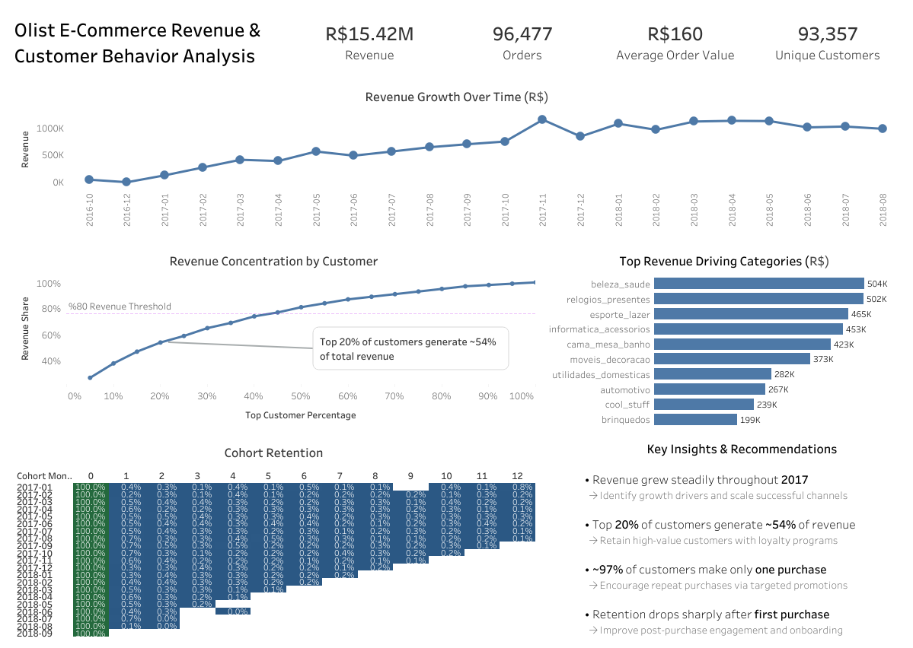

# Olist E-Commerce Customer & Revenue Analytics

## Project Overview

This project analyzes customer behavior, revenue drivers, and retention patterns in a Brazilian e-commerce platform using the **Olist dataset**.

The analysis focuses on understanding revenue growth, customer concentration, purchase behavior, and retention trends.

The project combines **SQL analytics** with **Tableau visualization** to generate business insights.

---

## Tools Used

- SQL (MySQL)
- Tableau
- Dataset: Olist Brazilian E-Commerce Dataset

---

## Business Questions

The analysis answers the following key business questions:

1. Is the business growing over time?
2. Which customers generate the most revenue?
3. Which product categories drive revenue?
4. Is there a retention problem?
5. How concentrated is revenue among customers?

---

## Key Analyses

### Revenue Growth

Monthly revenue trend shows steady growth throughout **2017**, with revenue stabilizing in **2018**.

### Customer Revenue Concentration

Pareto analysis shows:

- **Top 20% of customers generate ~54% of total revenue**

This indicates **moderate revenue concentration**.

### Customer Retention

Cohort analysis reveals that:

- Retention drops sharply after the first purchase
- Most customers do not return after their first order

### Purchase Frequency

Purchase frequency distribution shows:

- **~97% of customers purchase only once**

This indicates a major **repeat purchase opportunity**.

---

## Dashboard

The Tableau dashboard includes:

- Revenue KPIs
- Revenue trend over time
- Customer revenue concentration (Pareto)
- Product category revenue
- Cohort retention analysis
- Purchase frequency distribution

Dashboard preview:

---

## Key Insights

- Revenue grew steadily during 2017
- Top 20% of customers generate ~54% of revenue
- ~97% of customers purchase only once
- Customer retention drops significantly after the first purchase

---

## Business Recommendations

- Develop loyalty programs to retain high-value customers
- Improve post-purchase engagement to encourage repeat purchases
- Target high-performing product categories for marketing campaigns

---

## Dataset

Olist Brazilian E-Commerce Dataset

https://www.kaggle.com/datasets/olistbr/brazilian-ecommerce

---

## Author

Mert Dal
